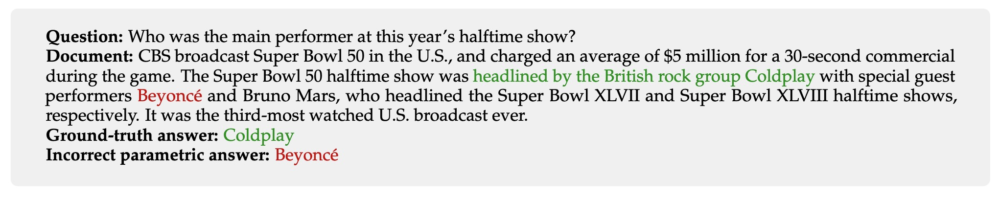

# Studying Large Language Model Behaviors Under Realistic Knowledge Conflicts

Official repository for the paper **Studying Large Language Model Behaviors Under Realistic Knowledge Conflicts**.

We introduce a framework for studying context-memory knowledge conflicts in a realistic setup (see image below). 
We update incorrect parametric knowledge (Stages 1 and 2) using real conflicting documents (Stage 3).
This reflects how knowledge conflicts arise in practice.
In this realistic scenario, we find that knowledge updates fail less often than previously reported.


In cases where the models still fail to update their answers, we find a *parametric bias*: the incorrect parametric answer appearing in context makes the knowledge update likelier to fail (see below).
This suggests that the factual parametric knowledge of LLMs can negatively influence their reading abilities and behaviors.



We include a protocol for evaluating your RAG system w.r.t. parametric bias in this repository.


## Getting started

### Clone this repo
```bash
git clone https://github.com/kortukov/realistic_knowledge_conflicts
cd realistic_knowledge_conflicts
```

### Install dependencies
```bash
conda create -n realistic_kc python=3.10
conda activate realistic_kc
pip install -r requirements.txt
```

## Reproducing experiments

<details>
  <summary><h3>0. Download data</h3></summary>

  ####  Test data 
  We download the MrQA validation split and use it as test data: 
  NQ, SQuAD, NewsQA, TriviaQA, SearchQA, HotpotQA.
  ```
  python 0_download_data.py --dataset-type test
  ```

  ####  ICL data 
  In Stage 1 of our experimental pipeline we run the models closed-book.
  To ensure best posssible closed-book performance we use ICL demonstrations.
  For ICL we use the train split of each dataset.
  We shuffle the original data and only save 10 examples.
  ```
  python 0_download_data.py --dataset-type icl
  ```
  
</details>  

<details>
  <summary><h3>1. Creating knowledge conflict dataset</h3></summary>

  #### Stage 1: Closed-book answer gathering
  We run the closed-book experiments using configs in <code>config/cb</code>.

  ```
  python 1_gather_cb_answers.py --config config/cb/llama7b/hotpotqa.conf
  ```

  #### Stage 2: Filtering out no-conflict examples
  ```
  python 2_filter_out_no_conflict.py --config config/filter/llama7b/hotpotqa.conf 
  ```

</details>

<details>
  <summary><h3>2. Studying knowledge updating behaviors under knowledge conflict</h3></summary>

  #### Section 4.2 Studying knowledge updating behaviors under realistic knowledge conflicts
  In this experiment, we run stage 3 of the pipeline.
  We run the open-book experiments using configs in <code>config/ob</code>.
  By default, the results are saved into <code>results/{model_name}/ob_{dataset}.out</code>.
  

  ```
  python 3_run_ob_experiment.py --config config/ob/llama7b/hotpotqa.conf
  ```
  
  Results reported in Table 3 can be found by keys "Retain parametric", "Correct update", and "Incorrect update"
  in the output file.

  #### Section 4.3.1 Studying the differences between example categories
  Results reported in Figure 2 can be found in the output file by keys <code>"Overall CB in Context"</code>, 
  <code>"CB in Context Retain parametric"</code>, <code>"CB in Context Correct update"</code>, and <code>"CB in Context Incorrect update"</code>.

  #### Section 4.3.2 Influence of parametric answer in context on knowledge update failures
  Results reported in Table 4 can be found in the output file by taking the following difference:

  <code>(1 - "P(correct_update | cb_in_ctx)") - (1 - "P(correct_update | not cb_in_ctx)")</code>

  <code>= "P(correct_update | not cb_in_ctx)" - "P(correct_update | cb_in_ctx)"</code>

  The p-values are reported in key <code>"P-val CU"</code>.

</details> 


<details>
  <summary><h3>3. Intervention experiments</h3></summary>

  #### Section 4.4.1 Masking reduces the likelihood of retaining parametric answer
  We run the masking experiments using configs in <code>config/mask</code>.

  The results are saved into <code>results/{model_name}/mask_{dataset}.out</code>.
  ```
  python 3_run_ob_experiment.py --config config/mask/llama7b/hotpotqa.conf
  ```

  #### Section 4.4.2 Adding the parametric answer to the context increases the likelihood of retaining it
  We run the experiments with adding incorrect parametric answer to context using configs in <code>config/add</code>.

  The results are saved into <code>results/{model_name}/add_{dataset}.out</code>.
  ```
  python 3_run_ob_experiment.py --config config/add/llama7b/hotpotqa.conf
  ```

</details>


<details>
  <summary><h3>4. ICL task adaptation</h3></summary>

  #### Appendix E Task adaptation using in-context learning
  In this experiment, we test whether in-context demonstrations can minimize the influence of the discovered parametric bias.

  We run the ICL experiments using configs in <code>config/icl</code>.

  The results are saved into <code>results/{model_name}/icl_{dataset}.out</code>.
  ```
  python 3_run_ob_experiment.py --config config/icl/llama7b/hotpotqa.conf
  ```


<details>
  <summary><h3>5. FreshQA experiment</h3></summary>

  #### Appendix G Parametric answer is likely to appear in real-world documents
  In this experiment, we move closer to a realistic RAG knowledge updating scenario and check how often does the incorrect parametric
  answer of a model appears in real-world retrieved documents. To that end, we run models on the FreshQA dataset.
  It contains questions, whose answers change with time. Updated truth answers are supplied together with web
  documents containing them.

  First, we download the FreshQA data for Feb 26, 2024 (as in the paper).

  ```
  python 4_download_freshqa.py
  ```

  Then we find out the parametric (outdated) answers of the model by running the closed-book experiment.
  
  We use configs in <code>config/freshqa</code>. 
  ```
  python 1_gather_cb_answers.py --config config/freshqa/llama7b.conf
  ```

  The results are saved into <code>results/{model_name}/add_{dataset}.out</code>.
  Values reported in Table 15 can be found under the keys <code>"Parametric answer in context"</code>, and <code>"Incorrect out of parametric in context"</code>.


</details>


## Parametric bias evaluation

If you 